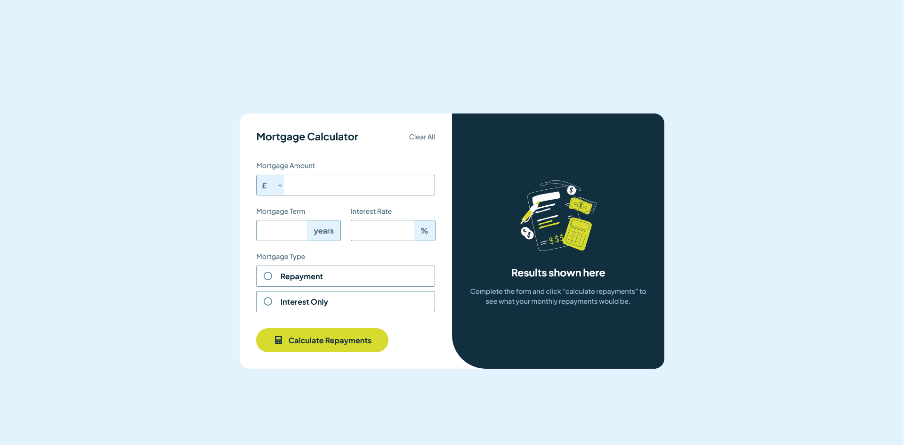
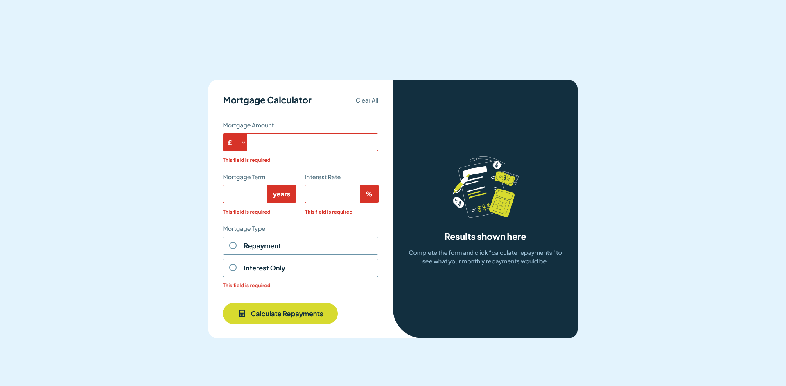
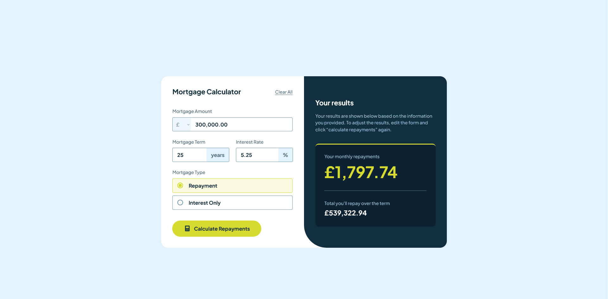

# Frontend Mentor - Mortgage Repayment Calculator Solution

This is a solution to the [Mortgage Repayment Calculator challenge on Frontend Mentor](https://www.frontendmentor.io/challenges/mortgage-repayment-calculator-Galx1LXK73). Frontend Mentor challenges help you improve your coding skills by building realistic projects.

## Table of contents

- [Overview](#overview)
  - [The challenge](#the-challenge)
  - [Screenshot](#screenshot)
  - [Links](#links)
- [My process](#my-process)
  - [Built with](#built-with)
  - [What I learned](#what-i-learned)
- [Author](#author)

## Overview

### The challenge

Users should be able to:

- Input mortgage information and see monthly repayment and total repayment amounts after submitting the form
- See form validation messages if any field is incomplete
- Complete the form only using their keyboard
- View the optimal layout for the interface depending on their device's screen size
- See hover and focus states for all interactive elements on the page

### Screenshots

<table align="center" style="border: none;">
  <tr>
    <td align="center" width="33%" style="border: none; vertical-align: top;">
      
       <b>Empty State</b>
    </td>
    <td align="center" width="33%" style="border: none; vertical-align: top;">
      
       <b>Error State</b>
    </td>
    <td align="center" width="33%" style="border: none; vertical-align: top;">
      
       <b>Completed State</b>
    </td>
  </tr>
</table>

### Links

- [Solution URL](https://github.com/Kking927/mortgage-repayment-calculator)
- [Live Site URL](https://kking927.github.io/mortgage-repayment-calculator/)

## My process

### Built with

- Semantic HTML5 markup
- CSS Custom Properties
- Flexbox
- CSS Grid
- Mobile-first workflow
- Vanilla JavaScript (ES6+)

### What I learned

Building this project was a great way to sharpen my front-end development skills. Key takeaways include:

* **JavaScript Practice:** Gained experience writing custom logic to handle form submissions, state changes, and input validation.
* **Error Handling:** Learned how to dynamically trigger and style custom error messages and input states when users interact with the form.
* **CSS Layout & Structure:** Improved my proficiency with CSS layout techniques.

## Author

- Frontend Mentor - [@Kking927](https://www.frontendmentor.io/profile/Kking927)
- GitHub - [Kking927](https://github.com/Kking927)
